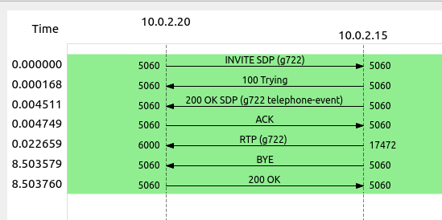
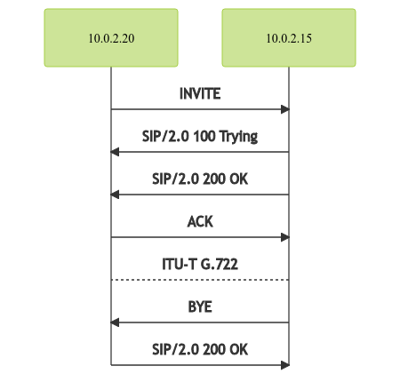
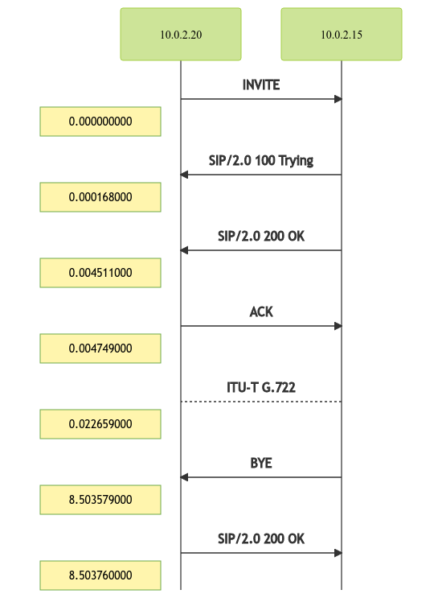

# Draw my call

Simple script to generate a call flow diagram from a pcap capture.
If your pcap capture contains sip and rtp packets, the script will try to generate a diagram as Wireshark do :



The script massively use [pyshark](https://github.com/KimiNewt/pyshark), [mermaid.js](https://mermaid-js.github.io/mermaid/#/) and others default packaged python3 libraries.

RTP exchanges are indicated only once, avoiding multiple useless lines. 

## Setup env 

> Tested on Ubuntu 20.10

- Install npm and mermaid.js.

```
apt update && apt upgrade
apt install npm --no-install-recommends
npm install mermaid.cli
```

> By default mermaid js script is located in `~/node_modules/.bin/mmdc`

- Install pip and pyshark

```
apt update
apt install python3-pip
pip3 install pyshark
```

- Clone this repo and give a try

```
git clone https://github.com/fulljackz/DrawMyCall.git
cd DrawMyCall
./drawmycall.py -t /path/to/pcap
```

## How it works

- Show help

```
./drawmycall.py --help
usage: drawmycall.py [-h] -f FILE [-t]

optional arguments:
  -h, --help            show this help message and exit
  -t, --time            Add time on diagram

required arguments:
  -f FILE, --file FILE  path to your pcap file
```

- Generate diagram

```
./drawmycall.py -f pcap_samples/SIP_CALL_RTP_G711
```

- Should produce something in `./output/` like :



- Generate diagram with time informations on the left

```
./drawmycall.py -f pcap_samples/SIP_CALL_RTP_G711 -t
```

- Should produce somethinkg like :



> Pcap samples are availble from wireshark web page : https://wiki.wireshark.org/SampleCaptures#sip-and-rtp


## Todo

- Improve diagrams for captures containing multiple sip and rtp streams.
