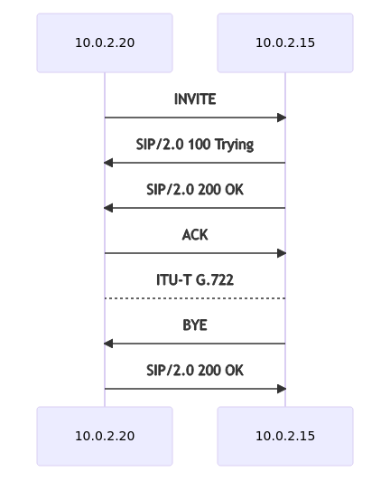
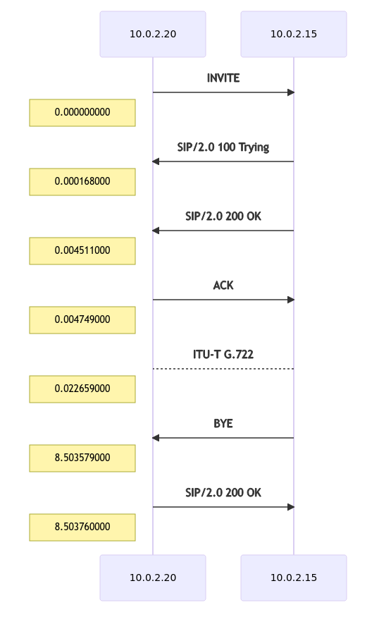

# Draw my call

Simple script to generate a call flow diagram from a pcap capture.
If your pcap capture contains sip and rtp packets, the script will try to generate a diagram as Wireshark do :


The script massively use tshark, [pyshark](https://github.com/KimiNewt/pyshark), [python markdown](https://python-markdown.github.io/), [md_mermaid](https://github.com/oruelle/md_mermaid) and others default packaged python3 libraries.

RTP exchanges are indicated only once, avoiding multiple useless lines. 

## Setup env 

> Tested on Ubuntu 20.10

```
apt update
apt install git tshark python3-pip --no-install-recommends
pip3 install pyshark markdown md-mermaid
```

- Clone this repo and give a try

```
git clone https://github.com/fulljackz/DrawMyCall.git
cd DrawMyCall
./drawmycall.py -t /path/to/pcap
```

## How it works

- Show help

```
./drawmycall.py --help
usage: drawmycall.py [-h] -f FILE [-t]

optional arguments:
  -h, --help            show this help message and exit
  -t, --time            Add time on diagram

required arguments:
  -f FILE, --file FILE  path to your pcap file
```

- Generate diagram

```
./drawmycall.py -f pcap_samples/SIP_CALL_RTP_G711
```

- Should produce a html file in `./html/` like :



- Generate diagram with time informations on the left

```
./drawmycall.py -f pcap_samples/SIP_CALL_RTP_G711 -t
```

- Should produce somethinkg like :



> Pcap samples are availble from wireshark web page : https://wiki.wireshark.org/SampleCaptures#sip-and-rtp


## Todo

- Improve diagrams for captures containing multiple sip and rtp streams.
- Improve setup
